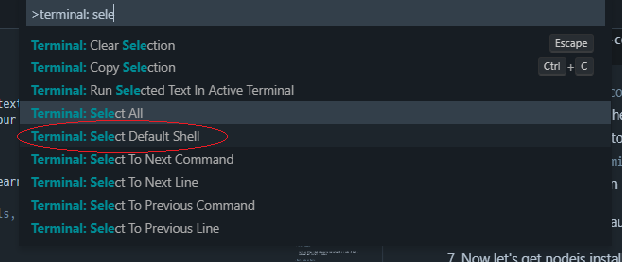
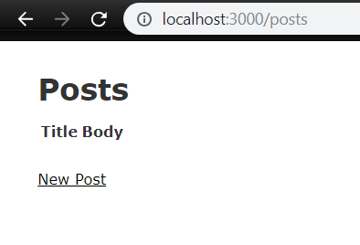
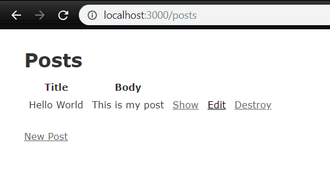

# Setting up Windows Subsystem for Linux for Development

*It is no longer necessary to enable developer mode for Windows Subsystem Linux to work*

## Getting Windows Ready

1) Windows Subsystem Linux (WSL) is **not** automatically enabled on windows. So, to start off, we need to enable it!  
    1) Go to your Windows Search bar and type in `turn windows features on or off`
    2)  Click on the result that matches your query. It will be in your Control Panel.  You should see something like this:  
   

    3)  Scroll down until you see "Windows Subsystem for Linux" - ensure its box is checked!  
   
2)  Restart your computer
3)  Check your Windows 10 version by going to `System Information` and checking your Version. If your build is earlier than 16215, skip step 4 and proceed to step 5.  
   
4)  Open up Microsoft Store. Search for "Ubuntu"
    1) Choose "Ubuntu" 
5) If you run into errors or if you have an early version of Windows 10, see further information [here](https://docs.microsoft.com/en-us/windows/wsl/install-win10)
6) Open up the Ubuntu app. Follow the prompts, which will include making a username and password. Don't forget your password!

## Start Outfitting your new Linux Subsystem: RVM / Ruby, learn-co, git, NodeJS, and Rails

1) Once everything is set up, we can start setting up our system! Start off by running the following to download our dependencies: 


    ``` 
    sudo apt-get update  
    ```
    ```
    sudo apt-get install git-core curl zlib1g-dev build-essential libssl-dev libreadline-dev libyaml-dev libsqlite3-dev sqlite3 libxml2-dev libxslt1-dev libcurl4-openssl-dev software-properties-common libffi-dev libpq-dev libgdbm-dev libncurses5-dev automake libtool bison gnupg
    ```
2) Install RVM by running:

    ```
    gpg --keyserver hkp://keys.gnupg.net --recv-keys 409B6B1796C275462A1703113804BB82D39DC0E3 7D2BAF1CF37B13E2069D6956105BD0E739499BDB
    ```
    followed by

    ```
    \curl -sSL https://get.rvm.io | bash -s stable --ruby
    ```
    and finally

    ```
    source ~/.rvm/scripts/rvm
    ```

3)  Next, to set up a ruby version most compatible with Learn.co labs, we want to download ruby 2.3.3 and set it as our default: 

    ```
    rvm install 2.3.3
    rvm use 2.3.3 --default
    ```

4)  Let's install the bundler gem:

    ```
    gem install bundler
    ```
5)  And set up git:

    ```
    git config --global color.ui true
    ```
    For the next few commands, make sure to input your specific information:

    ```
    git config --global user.name "your_name"
    ```

    ```
    git config --global user.email "your_email@example.com"
    ```
    You can either communicate with your remote repositories via HTTPS or SSH. If you want to use SSH (which means you will not have to authenticate with your GitHub username and password before each push) - [follow these instructions.](https://help.github.com/articles/generating-a-new-ssh-key-and-adding-it-to-the-ssh-agent/)

6)  Now we can get set up with the learn-co gem. This will allow you to use commands like `learn`, `learn submit`, and `learn open`.

    ```
    gem install learn-co
    ```
    - In your browser, navigate to learn.co/your_github_username 
    - At the bottom of the page, you should see text that says `OAuth Token:` followed by a token. Copy the token, and then go back to your WSL terminal
    - Type:  
        ```
        learn whoami
        ```
    - Paste in your token  

    You should now be fully authenticated with learn.

7)  Now let's get NodeJS installed, and then Rails so we can make a bunch of stuff!

 - First, nodejs: 

    ```
    curl -sL https://deb.nodesource.com/setup_10.x | sudo -E bash -
    sudo apt-get install -y nodejs
    ```

- Next, Ruby on Rails:
    ```
    gem install rails
    ```

## Choose your programming editor weapon: VSCode

You can use any editor you want, but I am going to be walking through setting up VSCode.

1) Download VSCode [here](https://code.visualstudio.com/download). Choose the Windows download, not the Linux download. Any required Linux downloads will be done via the Ubuntu terminal, and everything else should be downloaded for your Windows OS.

2) To configure your Ubuntu terminal to be available in VSCode: 

    - open up VSCode
    - open the Command Palette via `F1` or `Ctrl`+`Shift`+`p`
    - begin typing the following: `Terminal: Select Default Shell`  until you see it. Select that option.

      

    - Once you select it, a few options will pop up. You want to select WSL

    
3) Now, you can use your Ubuntu terminal in VSCode. Select "New Terminal" in the "Terminal" drop-down, or type `Ctrl`+`Shift`+` in order to use it!

4) Additional User Settings:
    - You can add a few things to your User Settings to customize and improve your programming experience. Most importantly, we can make VSCode treat .erb files like .html files, allowing us to use all the same shortcuts and get the same syntax highlighting. 
    - To open up user settings, again open up the Command Palette using `F1` or `Ctr`+`Shift`+`p` and type `Preferences: Open Settings (JSON)`
    
    - You will see a screen like this:
    
    - to have your erb files treated like html, add the following to your user settings (circled above):
        ```
        "emmet.includeLanguages": {
            "erb": "html"
        }
        ```
    - some optional personal preferences that I like:
        ```
        "window.zoomLevel": -1,
        "editor.acceptSuggestionOnEnter": false,
        "editor.fontSize": 11,
        "editor.fontFamily": "Hack, Consolas, 'Courier New', monospace",
         ```
    - Noe that for the Hack font to be usable, you have to downlload it. You can check it out [here](https://sourcefoundry.org/hack/).


## Important Knowledge: Basic Use 

Your terminal is actually accessing an Ubuntu Virtual Machine which is running inside of your Windows OS. If you ever ```cd``` in your terminal, you will be sent to the 'user home' of your Linux VM. That is also the default location you will be in when you open your Ubuntu app. You actually want to do all of your business inside of your normal Windows file space, not your Linux VM file space. So, you will need to know how to navigate in your terminal from your Ubuntu file system to your Windows file system. This is pretty simple if you understand how the system is set up, so let's go over that quickly. 

To allow you to access the functionality of a Linux machine, Windows stores the Ubuntu OS and file system inside of its own file system. You should NEVER access your Ubuntu files via your Windows machine. What you SHOULD do is save everything you are working on in your normal Windows filespace, and access that via your Ubuntu terminal. So, how do you do that? Well, from the Ubuntu's point of view, it is just a normal Linux machine, but Microsoft has made a pathway between the Linux VM and your Windows OS via the `/mnt` directory in your Ubuntu's root. 

Here is a quick visual of what the first few levels of any Linux filesystem look like:  


As you can see, the `mnt` directory is made for other filesystems, so that is where Microsoft connected your Linux to your Windows machine:


So, you can get there from your starting point by typing: 

```
cd /mnt/c/users/your_windows_username
```
or 
```
cd ../../mnt/c/users/your_windows_username
```
If you put either of those lines at the bottom of your .bashrc file (found in `/home/your_linux_username/.bashrc`) you will automatically be started in your windows home directory when you start up your Ubuntu app, which is ideal. 

You can easily change your .bashrc file by navigating to your Linux home (by running just `cd`) and typing:

```
nano .bashrc
```

You are going to want to backup your .bashrc file first though so you don't mess it up. You can do that by copying a backup using

```
cp .bashrc .bashrc.bak
```

You save a file you have modified in `nano` by following the directions at the bottom of the screen: click `Ctrl`+`X` and then `Enter` to save your changes.

If you feel uncomfortable with these commands, check out the basic Linux commands link below in the resources. 

Remember, put all of your stuff in your windows directories! That way, you have access to it via your Linux Terminal or your Windows OS, and your VSCode editor can open to the correct location when you use
```
code .
```
(if you are in your Linux file system, VSCode will open, but not to the right spot).

## Advanced topics: Database setup, .bashrc, .learn-config

**.bashrc and .learn-config modifications**

To get a learn-customized .bashrc file, follow simple instructions [here](https://github.com/Enoch2k2/flatiron-wsl-bashrc)

If you travel to your Linux home directory by typing `cd`, you can change your .learn-config by typing 
```
nano .learn-config
```

and customizing where you want the ```learn open``` command to save labs, and setting your editor to VSCode. Here's what mine looks like: 

```
---
:learn_directory: "/mnt/c/users/micah/dev/flatiron/labs"
:editor: code
```


**Setting up PostgreSQL allows simple production-level database integration into a Rails project. This allows easy hosting on Heroku with only a little setup.**

1) First, we want to [Download PostgreSQL for Windows](https://www.postgresql.org/download/windows/) - download the Interactive Installer.
2) Once everything is downloaded, you can verify proper operation by typing in your terminal

    ```
    psql -p 5432 -h localhost -U postgres
    ```
    once connection is verified, you can quit by typing
    ```
    \q
    ```

3) There are a few ways to do the next few steps but the easiest way is to use pgAdmin. Open up pgAdmin, which is a Graphical User Interface for PostgreSQL. 


 - This should open up pgAdmin in your browser. Start a server by right-clicking "PostgreSQL" and selecting "Connect Server"


 - Enter the password you defined during the download
 - Your PostgreSQL server is running, and can now be integrated into your projects.
 - You also want to set up a new user/role and password that you want to use with your rails app. Ensure you give your user/role all available permissions during setup.
    - During setup, ensure to fill out `Name` in the `General` tab, `Password` in the `Definition` tab, and enable all permissions in the `Privileges` tab.

  


  **EXAMPLE: CONNECTING YOUR POSTGRESQL SERVER TO YOUR RAILS APP**

  - Make sure your server is connected and roles are configured as described above.
  - Make sure you are in a suitable directory (in your Windows file system space) and create a Rails app configured to use PostgreSQL: 
    ```
    rails new my-first-app --database=postgresql
    ```    

- Now, let's configure our `database.yml` file to allow our app to connect to our database. Add the following to your `config/database.yml` file under BOTH `development:` and `test:` You will need to add a user and password which will correspond to the roles we created in pgAdmin.

    ```
    host: localhost
    user: your-postgres-username
    password: your-postgres-usernames-password
    ```
- We can now test our database and rails interoperability by first setting up some architecture in our app: 

    ```
    rails g scaffold Post title:string body:text
    ```
- now create and migrate a database:

    ```
    rake db:create
    rake db:migrate
    ```

- If these fail, ensure you have added your database.yml configurations under both the development AND test sections

- Now, start a server:
    ```
    rails s
    ```
- If you navigate to `localhost:3000` you should see that we are on Rails!  
  
- Let's test our database by going to 'localhost:3000/posts'   
  
- Now just follow the crud links and try to make a post! We should be seeing our database working great with our rails app!



- Hopefully, everything is working for you! Now you're ready to develop using WSL!
---
## Resources

[Microsoft Documentation: Windows Subsystem for Linux]( https://docs.microsoft.com/en-us/windows/wsl/install-win10)  
[Setting up a SSH Key with GitHub](https://help.github.com/articles/adding-a-new-ssh-key-to-your-github-account/)  
[Basic Linux Commands](https://maker.pro/linux/tutorial/basic-linux-commands-for-beginners)